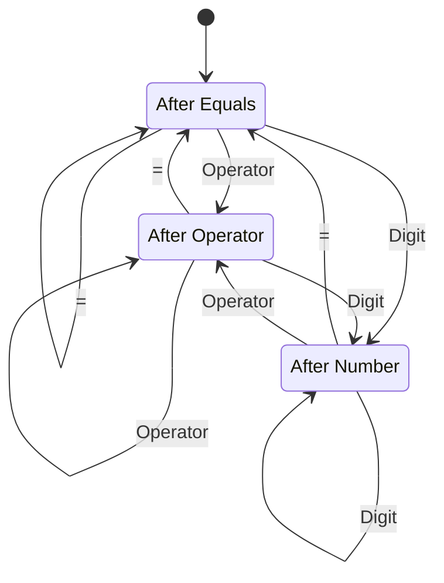

# AdverCalculator

A web calculator with a .NET backend and a React front-end, an evaluation assignment for Adver.

Details of the requirement conversation are on the bottom.

## Evaluation

Documenting the process: for a greenfield project, or anything that feels
"involved," I start like this. It's a bit excessive here, but I'm doing it for
illustration.

### Requirements

- A web application that allows basic arithmetic operations.
- The UI should resemble a traditional calculator with buttons for entry and operations.
- The task should be done in approximately 2 hours.

### Decisions and Considerations

- Choice of technology
  This will be an ASP.NET Core + React application.
  - Ideally this application would use Angular and Bootstrap, but with my
    background React will be considerably quicker to implement.
  - For this task, taken literally, a backend isn't useful - but considering
    the context involving the evaluation of my full-stack skills, it seems
    reasonable.
- Timing.
  My work will be a bit heavy on design, and I don't want to strictly time
  track, so I'll allow myself to take a bit longer - but only dedicating a
  single evening to it.
- Front-end will superficially resemble a traditional calculator, described in
  process flow below.
- The design will involve making an RPC-style call to the back-end for
  an operation with its operands.
  - For more advanced tools, it could be nice to have some representation of
    "session state." This isn't a part of requirements, and would increase the
    time spent on design.
  - We're not operating with any persistent entities, so REST-style semantics
    don't really fit.
  - End points will be related to method calls.
    This isn't often the best choice, but in this case it just involves the
    least thinking.

### Conceptual Model of The Program

Calculators have a somewhat interesting process flow, that enables some "hacks"
that increase the user's speed considerably. In this exercise I figured out the
mechanics by playing with the built-in Windows calculator. In real life, I'd
converse with a project owner (or equivalent) to find out the actual needs and
balance it with the cost to implement them.

Spent a bit too much time on it because it was, quite honestly, fun.

The overall functioning can be shown on the following chart:

Furthermore the calculator state will contain three variables:

- `Current Operator` (one of `noop`, `+`, `-`, `*` and `/`)
  The noop operator is special and used during startup. It returns the right
  operand.
- `Left Operand`
- `Right Operand`

#### Startup

- `Left Operand` is set to 0.
- `Right Operand` is set to 0.
- `Current Operator` is set to `noop`.
- We transition to the `After Evaluation` state.

#### Operator Pressed in `After Equals` or `After Operator`

- `Current Operator` is set to the selected operator.
- `Right Operand` is set to `Left Operand`.
- We progress to the `After Operator` state.

This means that, for example, the sequence `12 * 3 = - =` will give `0`:

- `12 * 3 = 36`
- `36 - 36 = 0`

#### Operator Pressed in `After Digit`

- Lock the UI.
- `Current Operator` is set to the selected operator.
- Evaluate the operation of `Left Operand [Current Operator] Right Operand`.
- `Left Operator` is set to the operation's result.
- Unlock the UI.
- Progress to `After Operator`.

Note that the right operand remains untouched.

#### `=` Pressed (in any state)

- Lock the UI.
- Evaluate the operation of `Left Operand [Current Operator] Right Operand`.
- `Left Operator` is set to the operation's result.
- Unlock the UI.
- Progress to `After Equals`.

Note that both `Right Operand` and `Current Operator` remain untouched.
Repeatedly pressing `=` will result in repeating the operation multiple times,
like `12*3*3*3`.

#### Digit Pressed in `After Equals` or `After Digit`

- `Right Operand` is replaced with the digit.
- We progress to `After Digit`.

#### Digit Pressed in `After Digit`

- Append the digit to the end of `Right Operand`.
- We progress to `After Digit`.

## Assignment

Develop a simple calculator in a .NET environment

### Requirements

- The calculator must be capable of performing basic operations such as addition, subtraction, multiplication, and division.
- The calculator should have a user interface with buttons for numbers and the four basic operations.
- It should be able to accept user input and display the result of the operation.

### Points to consider

- Use appropriate technology within the .NET ecosystem.
- Attempt to document what you do. This can be in the form of comments in the code or any other method you find suitable.
- Be prepared to present the project to us.
- While a complete implementation is not required, we do expect some working functionalities. Ensure that you test the basic functionalities.
- You will need to share your code with us. Please let us know how you would like to do that.

### Time limit

Allocate a maximum of 2 hours to this task.

Don't worry; we don't expect a fully finished product. However, it's important for us to see the plan and your approach.

### Objective and evaluation

The purpose of this task is to assess your programming skills and problem-solving abilities. The evaluation will focus on the steps you have taken, the decisions you have made, and the quality of the implementation within the given time limit.

### Questions

- A graphical calculator performing addition, subtraction, division and multiplication.
  Correct.
- There should be a UI that makes entry with buttons reasonable - I assume classic �skeuomorphic� approximation of a physical calculator.
  Correct.

- Do you expect a web application, a native Windows application, something else, or my own choice?  
  We prefer a web application (.Net c# / MVC or Angular) with Bootstrap framework for the UI.  

- Are there any specific expectations regarding the precision of operations?
  It�s up to you how precise you�d like to be.
